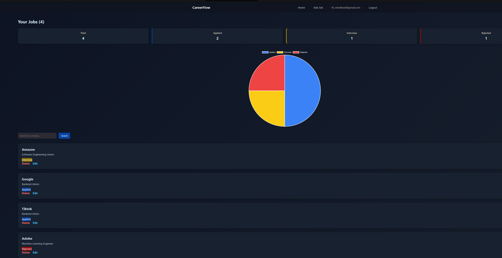
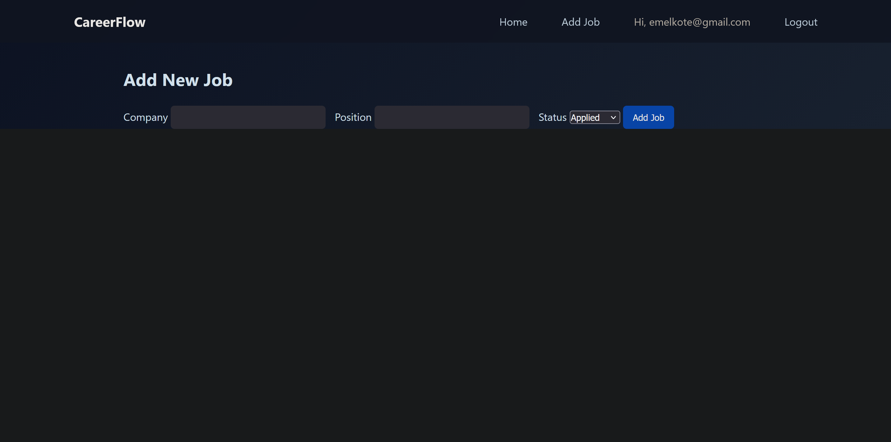
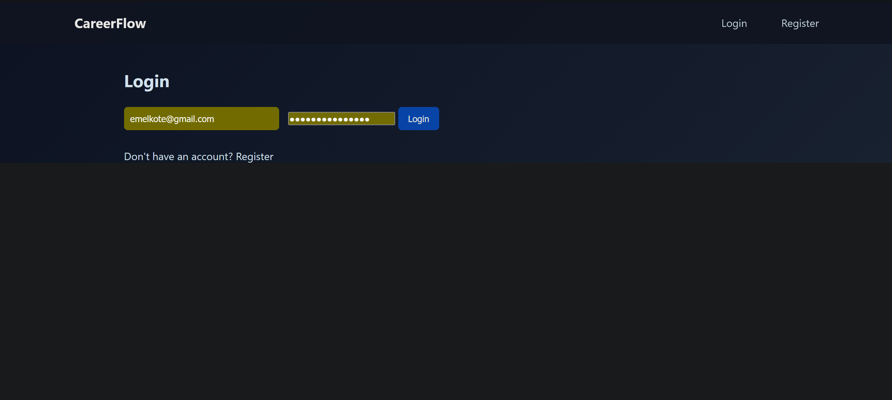
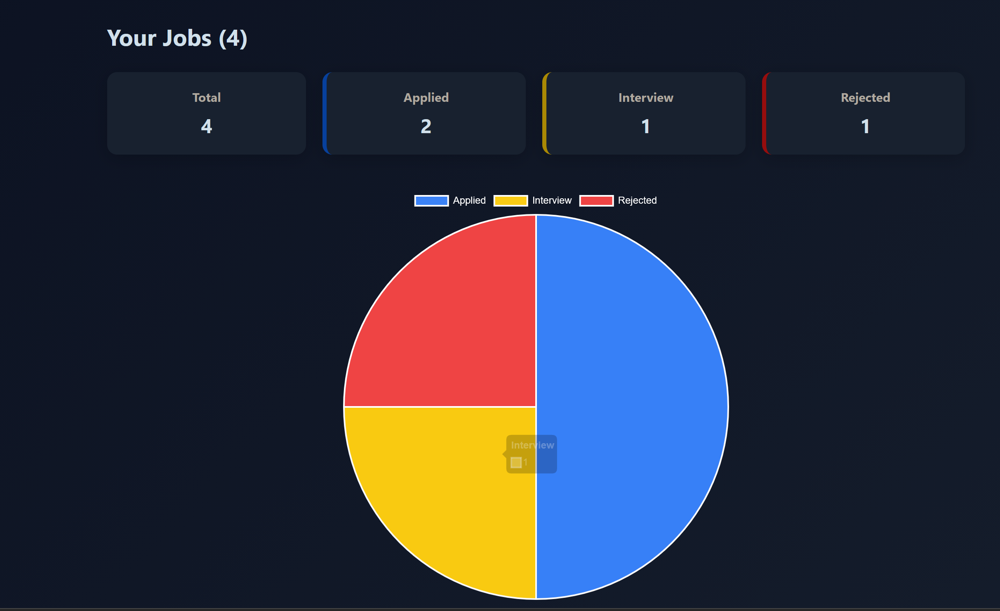

# CareerFlow – Job Application Tracker

Built with Flask, authentication, analytics dashboard, and multi-user job tracking.

## Features
- User Authentication (Flask-Login)
- Secure password hashing
- Add, Edit, Delete jobs
- Status filtering and search
- Dashboard analytics
- Pie chart visualization (Chart.js)
- Multi-user data separation

## Tech Stack
- Python
- Flask
- SQLite
- Flask-Login
- Chart.js
- HTML/CSS

## How to Run

1. Clone the repository  
2. Create a virtual environment  
3. Install dependencies  
   pip install flask flask-login werkzeug
4. Run the app  
   python app.py

## Screenshots

### Dashboard

### Add Job

### Login

### Analytics Chart

